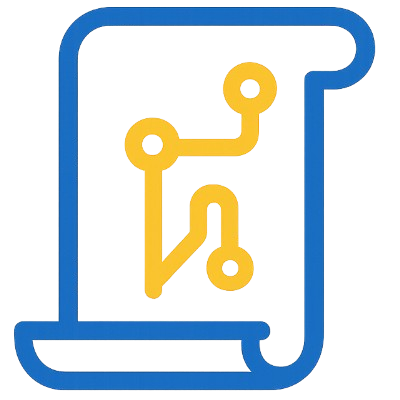
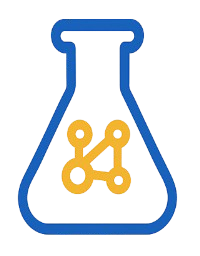
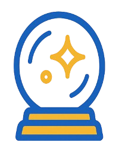
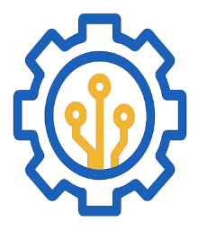

  

<h1 align="center">⚗️ ModalAlchemy</h1>

  <em>A structured, evolving knowledge base for LLM, MLLM, and AI research ✨</em>

  
  

---

## 📚 Table of Contents

- [📚 Table of Contents](#-table-of-contents)
- [🧠 About](#-about)
- [✨ Recent Updates](#-recent-updates)
- [🗂️ Structure](#️-structure)
- [📖 How to Use](#-how-to-use)
- [🏷️ Philosophy](#️-philosophy)
- [📜 License](#-license)

---

## 🧠 About

> **ModalAlchemy** is my personal digital lab notebook, designed for:

-  **Paper readings** — organized by topic & publication date
-  **Experiment logs** — chronologically tracked
-  **Insights & reflections** — time-stamped
-  **Summaries & how-to notes** — engineering, theory, best practices
-  **Codebase** — usage, troubleshooting, best practices

> 🌍 Notes are **bilingual (English & 中文)**

---

## ✨ Recent Updates

> 📰 Stay up to date with the latest additions and breakthroughs!

| Date       | Update                                                                                                                             |
| ---------- | ---------------------------------------------------------------------------------------------------------------------------------- |
| 2025-08-27 |  Agent [Insight Note](./insights/202508_agent.md)                                     |
| 2025-08-25 |  opencompass [Usage Intro](./codebase/opencompass.md)                                 |
| 2025-08-24 |  Transformer related calculations [Summary](./notes/202508_transformer.md)               |
| 2025-08-19 |  Generalist Reward Modeling (GRM) [Reading Note](./papers/llm/train/rl/20250405_grm.md) |
| 2025-08-18 |  Dynamic Fine-Tuning (DFT) [Reading Note](./papers/llm/train/sft/20250807_dft.md)       |
| 2025-08-18 |  Persona [Reading Note](./papers/llm/data/20240628_persona.md)                          |
| 2025-08-18 |  DAPO [Insight Note](./insights/202508_grpo.md)                                       |
| 2025-08-17 |  DAPO [Reading Note](./papers/llm/train/rl/20250318_dapo.md)                            |
| 2025-08-16 |  vllm [Usage Intro](./codebase/vllm.md)                                               |
| 2025-08-16 |  uv [Usage Intro](./codebase/uv.md)                                                   |

🔎 <b>Click to view previous updates</b>

---

## 🗂️ Structure

| 📁 Category | Description                                                |
| ----------- | ---------------------------------------------------------- |
| `/papers`   | Paper notes (topic & publication date)                     |
| `/exps`     | Experiment logs (chronological)                            |
| `/insights` | Insights & reflections (dated)                             |
| `/notes`    | Summaries, how-to, comparisons                             |
| `/codebase` | Engineering notes (usage, troubleshooting, best practices) |
| `index.md`  | Master index for navigation                                |
| `README.md` | Project introduction                                       |

---

## 📖 How to Use

- 🔎 Explore **`/papers`** for topic-based reading notes.
- 🧪 Visit **`/exps` & `/insights`** for chronological experiment logs & evolving thoughts.
- 🛠️ Use **`/notes` & `/codebase`** for distilled guides, engineering tips, and comparative notes.

---

## 🏷️ Philosophy

> This is a **living, imperfect, and ever-growing notebook** —
> some notes may be outdated, but all reflect my research journey.

🌌 _Alchemy is about transformation — so is research._

---

## 📜 License

This project is licensed under the **MIT License** — see the [LICENSE](./LICENSE) file for details.
