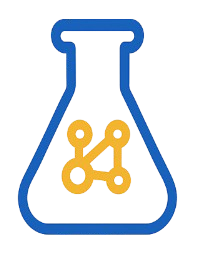

# Knowledge Index

Welcome to the master index of **ModalAlchemy**.
Use this page to quickly navigate by topic, date, or note type.

---

##  Papers by Topic

### LLM

#### Data

- [ persona (202406)](./papers/llm/data/20240628_persona.md)

#### Train

##### SFT

- [ dft (202508)](./papers/llm/train/sft/20250807_dft.md)

##### RL

- [ grm (202504)](./papers/llm/train/rl/20250405_grm.md)
- [ dapo (202503)](./papers/llm/train/rl/20250318_dapo.md)

---

##  Experiments (Chronological)

---

##  Insights

- [ grpo 202508](./insights/202508_grpo.md)

---

##  Summaries & How-to Notes

- [ transformer 202508](./notes/202508_transformer.md)

---

##  Codebase

- [ opencompass](./codebase/opencompass.md)
- [ uv](./codebase/uv.md)
- [ vLLM](./codebase/vllm.md)
